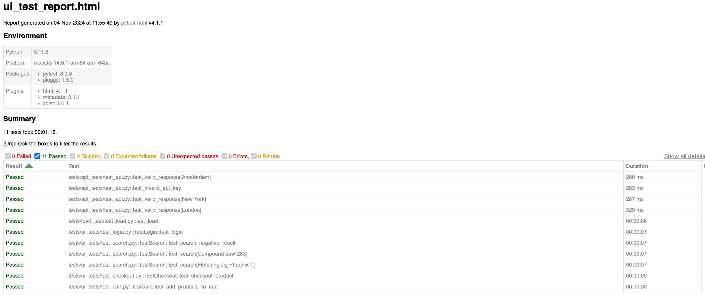
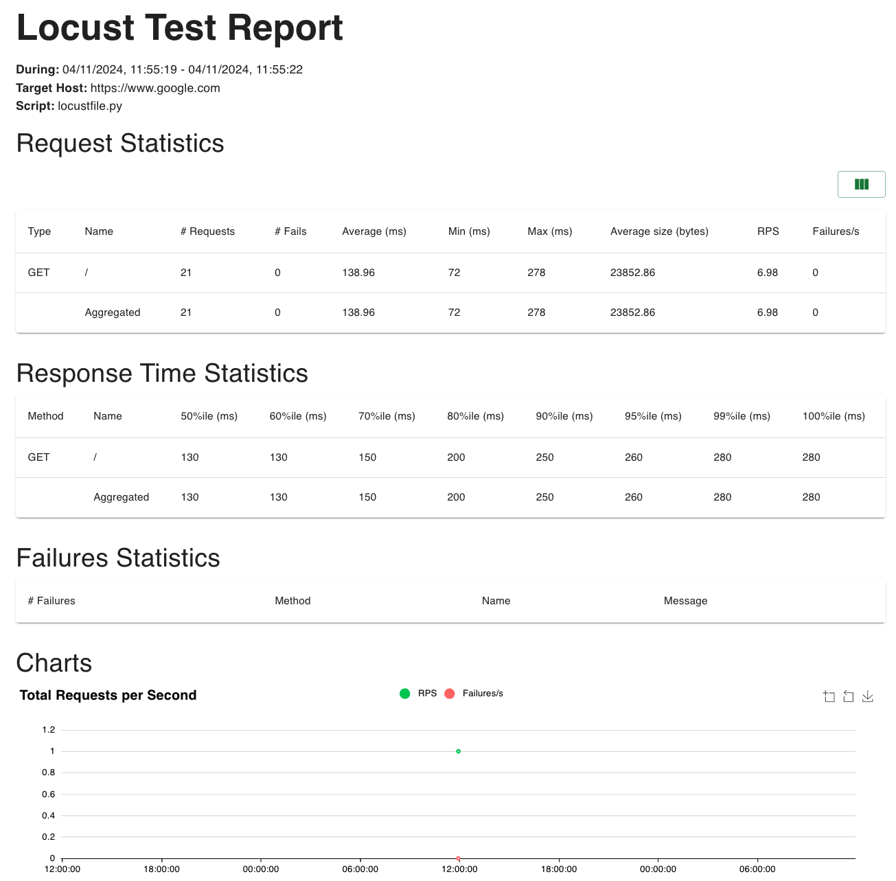

# SHELL RECHARGE QA ASSIGNMENT

You can find original assignment [here][Assignment]

[Sources][GitHub] | [UI under test][SATLinkUi] | [API under test][SATLinkApi] | [Load test target][SATLinkLoad] |

## Tech info

This test framework is writen using [PyTest](https://docs.pytest.org/en/stable/)
used [Selenium Webdriver](https://www.selenium.dev/documentation/webdriver/) for UI test and
[Locust][Locust] for load testing. [Makefile](Makefile) is used to create virtual environment
and dependencies can be found in [toml](pyproject.toml) file.

## Test description

This test framework contains three different types of test: UI, API and Load tests.
You can find description and test cases below for each one of them.

### API Tests

Positive and negative test cases for weather API service [weatherstack](SATLinkApi) were added.
Test are using [requests](https://pypi.org/project/requests/) library to verify current weather information.
You can find test scenarios [here](doc/API_TESTS.md) and test themselves [here](tests/api_tests/test_api.py)

### UI Test

Set of test created for popular e-commerce website for buying archery equipment [Europe archery][SATLinkUi]
Test are build with Page Object patter and verify basic functionality of login, search, and checkout process.
You can find test scenarios [here](doc/UI_TEST.md) and test themselves [here](tests/ui_tests)

### Load tests

Load test for [Google][SATLinkLoad] home page are built with [Locust][Locust], load can be configured via parameters in
[config file](config/config.yaml). Please find test description here [here](doc/API_TESTS.md)

## How to run the tests

Test can be run locally by executing

``` bash
 make run-test
```

Test will be also executed automatically on each commit in Github Actions

## How to view report

After test execution you can find two HTML report located in [reports](reports) folder. One report is for UI and API
test and another one is for load test. Here is example for Pytest report



Here you can see example of Locust report



## CI

Framework is using Github Actions to build and run test on each commit on any
brunch. [Main file](.github/workflows/main.yml) contains configuration, workflow and other related information.

## Prerequisites

To successfully run test please make sure that following is installed

- Python (version 3.9 or higher)
- PIP

## Project structure

Below you can find locations of the most important bids of the project:

- `tests` contains API, UI and Load tests
- `reports` HTML reports appear in this folder after test are complete
- `config/config.yaml` contains all the parameters for the tests
- `pages` contains Page Objects describing [Website under test][SATLinkUi]
- `locators` contains locators for same
- `locustfiles/locustfile.py` contains load test script

[Assignment]: doc/SRS_EU_QA_Assignment_-_October_2024.pdf

[GitHub]: https://github.com/DenUlyanov/srs-qa-assigment

[SATLinkUi]: https://www.europearchery.com/

[SATLinkApi]:  https://weatherstack.com/

[SATLinkLoad]:  https://www.google.com/

[Locust]: https://docs.locust.io/en/stable/
